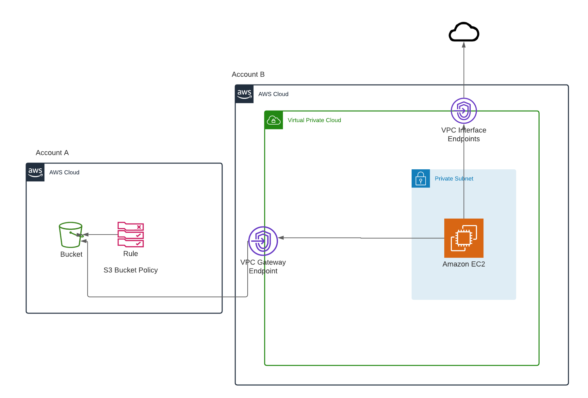

# Terraform Private VPC to S3 using VPC Endpoints

The project has been divided in two directories, one for each infrastructure per account.

## Architecture


### Part 1 - `infra_bucket`
This contains terraform code for the following:
- Create S3 bucket
- Associate a bucket policy for `secondary_aws_account` to perform `GetObject` and `ListObject` actions

#### Steps to run
```shell
terraform init
terraform plan -out plan.tfstate -var 'bucket_name=[bucket_name]' -var 'secondary_aws_account=[secondary_aws_account]'
terraform apply plan.tfstate
```

### Part 2 - `infra_instance`
This module creates a new 
- VPC 
- Private Subnet
- VPC Endpoint Security group
- VPC Endpoints
  - Interface - for SSM
  - Gateway - for S3
- EC2 Instance
  - with user data script to download and enable amazon ssm agent

#### Steps to run
```shell
terraform init
terraform plan -out plan.tfstate
terraform apply plan.tfstate
```